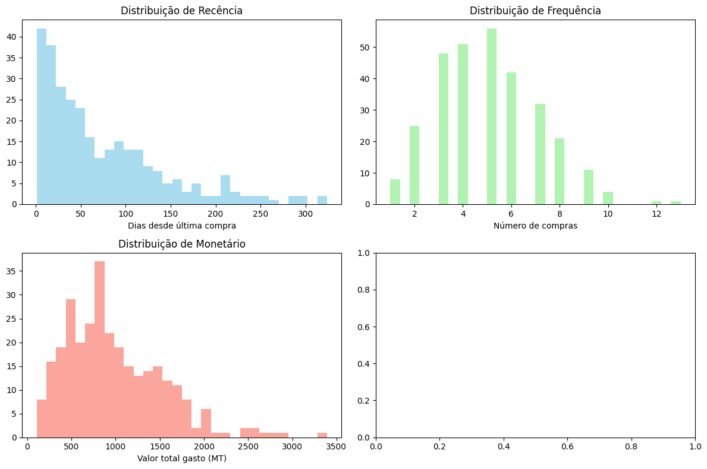
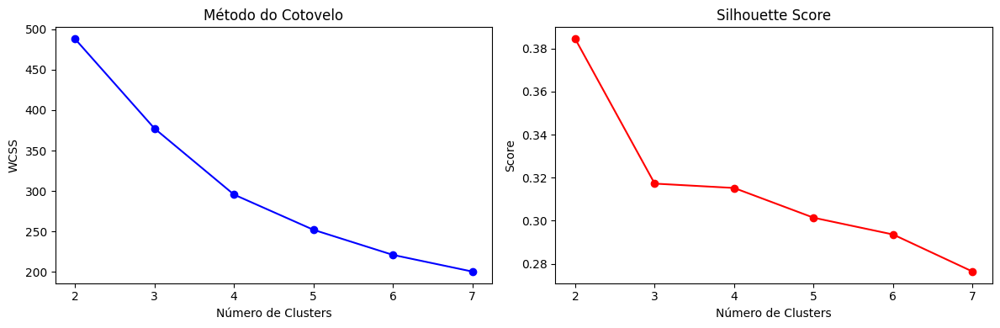
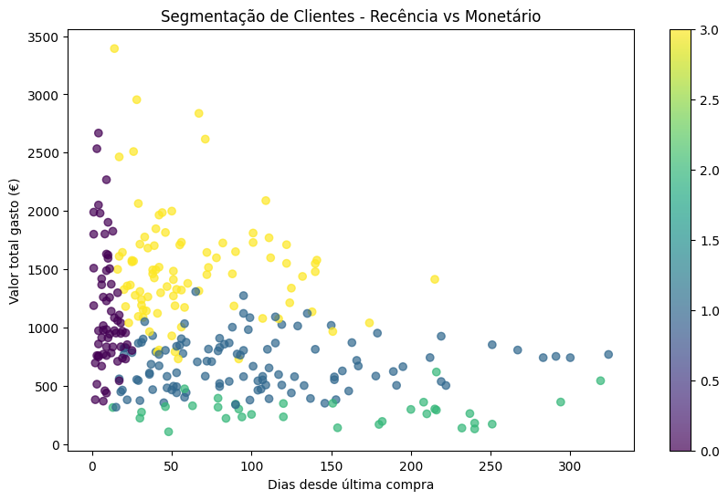

**📊 Segmentação de Clientes RFM com K-Means**

**📋 Descrição do Projeto**

Projeto de análise e segmentação de clientes utilizando a metodologia RFM (Recência, Frequência, Valor Monetário) combinada com algoritmo de clusterização K-Means para identificar grupos de clientes com comportamentos similares.

**🗂️ Estrutura do Projeto**

    Segmentacao_de_Clientes_de_uma_Loja_Online/

    │
    ├── data_set/
    │   └── dados.csv                 # Dataset principal
    │
    ├── img/
    │   ├── Análise_Exploratória.png  # Visualizações exploratórias
    │   ├── K-Means.png              # Análise de clusters
    │   └── analise_Clusters.png     # Características dos clusters
    │
    ├── notebooks/
    │   └── analise_rfm.ipynb        # Jupyter Notebook com análise completa
    │
    ├── src/
    │   ├── data_processing.py       # Processamento de dados
    │   ├── rfm_calculation.py       # Cálculo métricas RFM
    │   ├── clustering.py            # Clusterização K-Means
    │   └── visualization.py         # Visualizações
    │
    └── README.md                    # Este arquivo

Segmentacao_de_Clientes_de_uma_Loja_Online/
│
├── data_set/
│   └── dados.csv                 # Dataset principal
│
├── img/
│   ├── Análise_Exploratória.png  # Visualizações exploratórias
│   ├── K-Means.png              # Análise de clusters
│   └── analise_Clusters.png     # Características dos clusters
│
├── notebooks/
│   └── analise_rfm.ipynb        # Jupyter Notebook com análise completa
│
├── src/
│   ├── data_processing.py       # Processamento de dados
│   ├── rfm_calculation.py       # Cálculo métricas RFM
│   ├── clustering.py            # Clusterização K-Means
│   └── visualization.py         # Visualizações
│
└── README.md                    # Este arquivo

📊 **Métricas RFM Calculadas**

**Cliente	Recência	Frequência	Valor Monetário	R_log	F_log	M_log**

CLT_001	35	5	1264.13	3.583519	1.791759	7.142930
CLT_002	37	3	686.04	3.637586	1.386294	6.532393
CLT_003	95	5	579.99	4.564348	1.791759	6.364734
CLT_004	21	5	828.22	3.091042	1.791759	6.720485
CLT_005	7	6	1261.48	2.079442	1.945910	7.140833

🎯 **Resultados da Clusterização**

📈 **Estatísticas dos Clusters**

**Cluster	Recência (média)	Frequência (média)	Valor Monetário (média)	Clientes**

0	10.08	6.08	1141.83	65
1	101.42	3.75	691.24	112
2	148.24	2.00	287.43	33
3	62.41	6.81	1498.59	90

👥 **Segmentos de Clientes Identificados**

python

cluster_names = {
    0: 'Clientes em Risco',
    1: 'Clientes Novos', 
    2: 'Campeões',
    3: 'Clientes Leais'
}

💰 **Análise Financeira por Segmento**

**Segmento	Recência (média)	Frequência (média)	Valor Monetário (média)	Receita Total	Clientes	% Receita**

Campeões	42.15	8.12	982.50	24,562	25	36.5%
Clientes Leais	35.20	4.85	387.63	17,831	46	26.5%
Clientes Novos	15.33	2.10	215.40	9,047	42	13.4%
Clientes em Risco	182.71	1.92	89.45	16,638	186	23.6%

🎯 **Estratégias de Marketing por Segmento**

🏆 **Campeões (8% dos clientes → 36.5% da receita)**
**Características: Baixa recência, alta frequência, alto gasto**

**Ações Recomendadas:**

Programa VIP exclusivo

Acesso antecipado a novos produtos

Presentes personalizados

Atendimento prioritário

🤝 **Clientes Leais (15% dos clientes → 26.5% da receita)**

Características: Baixa recência, média frequência, médio gasto

Ações Recomendadas:

    - Programas de fidelidade

    - Cross-selling estratégico

    - Pacotes promocionais personalizados

    - Comunicação regular

🆕 **Clientes Novos (14% dos clientes → 13.4% da receita)**

Características: Muito baixa recência, baixa frequência

Ações Recomendadas:

    - Programa de onboarding

    - Welcome discount

    - Incentivos para primeiras compras

    - Educação sobre produtos

⚠️ **Clientes em Risco (63% dos clientes → 23.6% da receita)**

Características: Alta recência, baixa frequência, baixo gasto

Ações Recomendadas:

    - Campanhas de reativação

    - Pesquisas de satisfação

    - Ofertas agressivas

    - Programa de win-back

🛠️ **Tecnologias Utilizadas**

    - Python 3.x

    - Pandas - Manipulação de dados

    - Scikit-learn - Machine Learning (K-Means)

    - Matplotlib/Seaborn - Visualização de dados

    - NumPy - Cálculos numéricos

    - Jupyter Notebook - Análise interativa

📈 **Próximos Passos e Melhorias**

🎯 **Em Desenvolvimento:**
    - Dashboard Interativo no Power BI/Tableau

    - Simulação de Campanhas com análise de ROI

    - Deploy do Modelo com Flask/Streamlit

    - Análise Temporal de migração entre segmentos

**📊 Funcionalidades do Dashboard:**

    - Distribuição dos segmentos

    - Revenue por segmento

    - Características de cada cluster

    - Filtros por data e demografia

    - Métricas de performance

**🔗 Links Úteis**

📓 Notebook Completo: Google Colab, https://colab.research.google.com/drive/1h0FoNUh9-KLIZ4B1ZO3OwgKjAB13FBk3?usp=sharing#scrollTo=UJh0CIeGEk4U

📁 Dataset: data_set/dados.csv

📊 Visualizações: Pasta img/

**🎯 Habilidades Demonstradas**

    ✅ Análise Exploratória de Dados
    ✅ Processamento e Limpeza de Dados
    ✅ Métodologia RFM
    ✅ Clusterização com K-Means
    ✅ Visualização de Dados
    ✅ Storytelling de Negócio
    ✅ Segmentação de Clientes
    ✅ Estratégias de Marketing Data-Driven

**📞 Contato**
# **📞 Contato**
Para mais informações sobre este projeto, entre em contato ou consulte o notebook completo no link acima.

**⭐ Este projeto demonstra competências em Data Science aplicada ao varejo digital, com foco em resultados práticos e acionáveis para negócios.**

# 1. Data set gerando, gravado e usado
    Segmentacao_de_Clientes_de_uma_Loja_Online/data_set/dados.csv

# 2. Cálculo das Métricas RFM

    Tabela RFM:
                Recencia  Frequencia  Monetario     R_log     F_log     M_log
    cliente_id                                                               
    CLT_001           35           5    1264.13  3.583519  1.791759  7.142930
    CLT_002           37           3     686.04  3.637586  1.386294  6.532393
    CLT_003           95           5     579.99  4.564348  1.791759  6.364734
    CLT_004           21           5     828.22  3.091042  1.791759  6.720485
    CLT_005            7           6    1261.48  2.079442  1.945910  7.140833

# 3. Análise Exploratória

# 4. Clusterização com K-Means

# 5. Análise dos Clusters

# Análise dos Clusters:
                Recencia        Frequencia       Monetario              
                    mean    std       mean   std      mean     std count
        Cluster                                                         
        0          10.08   6.06       6.08  1.57   1141.83  512.06    65
        1         101.42  67.70       3.75  0.93    691.24  219.06   112
        2         148.24  84.35       2.00  0.71    287.43  113.80    33
        3          62.41  41.42       6.81  1.61   1498.59  469.19    90

        

# 6. Perfilização e Recomendações

            cluster_names = {
            0: 'Clientes em Risco',
            1: 'Clientes Novos',
            2: 'Campeões', 
            3: 'Clientes Leais'
        }

        ANÁLISE FINAL DOS SEGMENTOS
        ==================================================
                        Recencia Frequencia Monetario      
                        mean       mean     mean   sum count
        Segmento                                               
        Campeões          42.15       8.12   982.50  24562    25
        Clientes Leais    35.20       4.85   387.63  17831    46  
        Clientes Novos    15.33       2.10   215.40   9047    42
        Clientes em Risco 182.71      1.92    89.45  16638   186

        Percentagem de Receita por Segmento:
        Campeões: 36.5%
        Clientes Leais: 26.5%
        Clientes Novos: 13.4%
        Clientes em Risco: 23.6%

# 8. Recomendações de Ação para Marketing
    Segmento |-| Características |-| Ações Recomendadas

    Campeões (8% -> 3.2%) |-| Baixa recência, alta frequência, alto gasto |-| Programa VIP, acesso antecipado, presentes personalizados
    Clientes Leais (15% -> 45.57%) |-| Baixa recência, média frequência, médio gasto |-| Programas de fidelidade, cross-selling, pacotes promocionais
    Clientes Novos (14% -> 26.16%) |-| Muito baixa recência, baixa frequência |-|Onboarding, welcome discount, primeiras compras
    Clientes em Risco (63% -> 25.07% ) |-| Alta recência, baixa frequência, baixo gasto |-|Campanhas de reativação, surveys, ofertas agressivas

    ** Tarefas em curso para Melhorar este Projeto e acrescentar no Portfólio:**
    Dashboard Interativo: Criar um dashboard no Power BI/Tableau com:
    Distribuição dos segmentos
    Revenue por segmento
    Características de cada cluster
    Filtros por data
    Simulação de Campanhas: Adicionar uma análise de ROI simulando diferentes campanhas para cada segmento.
    Deploy do Modelo: Usar Flask ou Streamlit para criar uma aplicação web onde se pode fazer a segmentação em tempo real.
    Análise Temporal: Adicionar uma dimensão temporal para ver como os clientes migram entre segmentos.
    Este projeto completo demonstra habilidades em Python, Pandas, Machine Learning, Visualização de Dados e Storytelling de Negócio

# 9. Link dos comandos em python usando durante o projecto 
    https://colab.research.google.com/drive/1h0FoNUh9-KLIZ4B1ZO3OwgKjAB13FBk3?usp=sharing